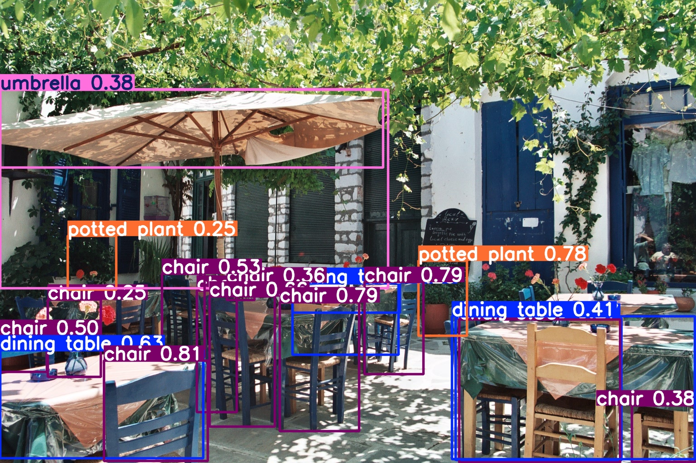

# YOLOv8 Object Detection using Ultralytics

This project demonstrates object detection on a single image using the pre-trained YOLOv8 model by Ultralytics.

## Objective
To load a YOLOv8 pre-trained model and perform object detection on an input image, saving the output with bounding boxes.

## Tools & Technologies
- Python
- Ultralytics YOLOv8
- OpenCV
- Google Colab

## Steps Followed
1. Installed the Ultralytics YOLOv8 package
2. Loaded the pre-trained YOLOv8 nano model (`yolov8n.pt`)
3. Performed object detection on an image
4. Saved the annotated output image with bounding boxes

## Files in Repository
- `detect.py` – Python script for object detection
- `requirements.txt` – Required dependencies
- `results.jpg` – Output image with detected objects

## Output

## Note
Live webcam detection is not supported in Google Colab due to environment limitations.
